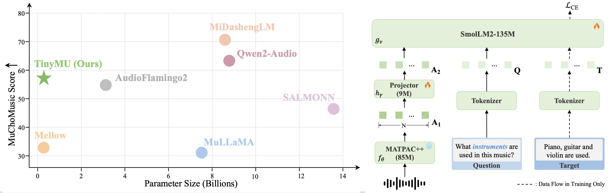
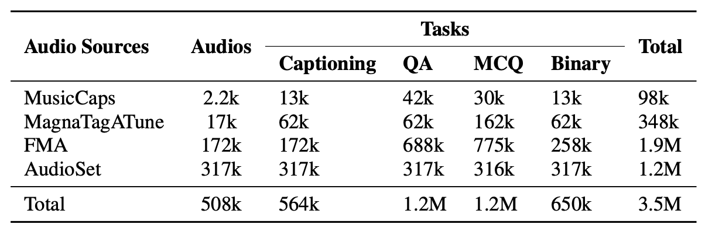

<div align="center">
<p align="center">
  <h1>TinyMU: A Compact Audio-Language Model for Music Understanding</h1>

  [](https://huggingface.co/AndreasXi/TinyMU)
  [](https://huggingface.co/datasets/AndreasXi/MusicSkills-3.5M)
</p>
</div>

## Overview
TinyMU is a compact (229M) Music-Language Model
with strong understanding and reasoning abilities. It achieves 82% of SOTA LALM’s performance on the MuChoMusic benchmark, while being 35x smaller. 

<div align="center">
  
</div>

## Environment setup: 
```
conda create --name tinymu python=3.11
conda activate tinymu

cd TinyMU
pip install -r requirements.txt
```

## Quick Start 
Run the following command to try out the TinyMU model: 
```
python demo.py --audio_path ./resource/example1.wav --prompt "Describe the music you hear."
```
This will automatically download the pretrained TinyMU model to the `./ckpt` folder from the [huggingface repo](https://huggingface.co/AndreasXi/TinyMU), and do the infer. 

## MusicSkills-3.5M 
The composition of MusicSkills-3.5M is shown in the table below. The dataset includes four types of tasks that span diverse music knowledge and reasoning skills.
The json metadata can be downloaded from [here](https://huggingface.co/datasets/AndreasXi/MusicSkills-3.5M). 

<div align="center">
  
</div>

The format of the dataset is a JSON file of a list of dicts: 
```
[
    {
        "file_name": "_Ra1Y6K7nSs_0.000_10.000.wav",
        "input_text": "Caption the music",
        "target_text": "This reggae song features male voices singing the main melody in harmony...",
        "dataset": "MusicCaps",
        "task": "Captioning"
    },
    ...
]
```
Where 
- `file_name` refers to the name of the audio file 
- `input_text` is the instruction provided to TinyMU
- `target_text` is the output supervision used for loss calculation
- `dataset` denotes the dataset the sample belongs to
- `task` specifies the task type for this sample

## Training
Before training, make sure all the checkpoints from [here](https://huggingface.co/AndreasXi/TinyMU) are in `./ckpt/`.

For data preparation, please organize your dataset following the [MusicSkills](https://huggingface.co/datasets/AndreasXi/MusicSkills-3.5M) JSON format. Each sample should contain at least the five keys mentioned above.

After the data is prepared, we need to setup the training configuration file. An example is provided at `src/config/train_tinymu.yaml`. 
Make sure that each entry in `train_audio_dirs` matches the corresponding JSON file in `train_json_files`: specifically, the *i*-th directory in `train_audio_dirs` should contain all `.wav` files referenced by `train_json_files[i]`.

After everything is prepared, run the following script to train a model
```
bash scripts/train_tinymu.sh
```

## Inference
Once the training is done, run 
```
bash scripts/infer.sh
```
to use the model to generate an output given a prompt and a music clip. You need to set `exp_dir` which is the experiment dir you set for training. This will automatically build a model from the config file and load the pre-trained ckpt to do the infer.


## Evaluation 
TODO 

## Acknowledgement
The encoder of TinyMU is based on [MATPAC](https://github.com/aurianworld/matpac). 
We also borrow parts of the inference code from [Mellow](https://github.com/soham97/mellow). 
 

## Citation
TODO
